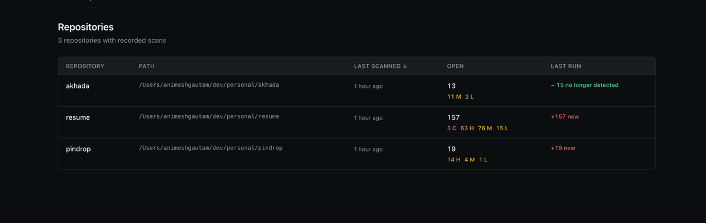
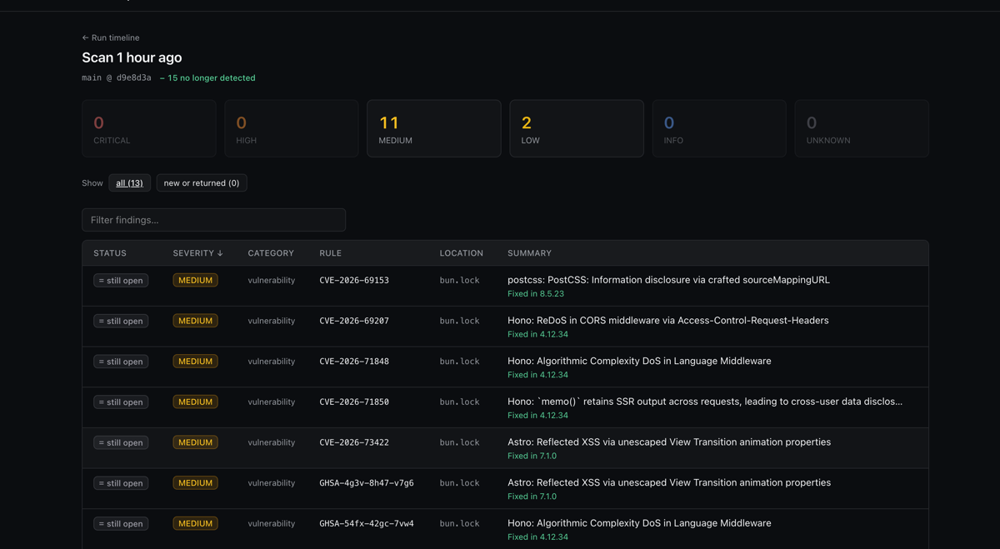

<p align="center">
  
</p>

<h1 align="center">Pindrop</h1>

<p align="center">
  <strong>Security scanning that tells you what to fix, not everything that's wrong.</strong>
</p>

<p align="center">
  One binary. Four scanners. Eight issues instead of two thousand.
</p>

<p align="center">
  <a href="#install">Install</a> ·
  <a href="#usage">Usage</a> ·
  <a href="#dashboard">Dashboard</a> ·
  <a href="#commands">Commands</a>
</p>

---

## Features

- **Ranked output** — four scanners, one table; cross-tool dedup turns 25 raw findings into 19 you can actually read
- **Stable fingerprints** — same issue stays the same issue when code moves, versions bump, or a second tool agrees
- **Scan history** — every run recorded in SQLite; the next scan shows what changed, not a wall of JSON to diff by hand
- **Embedded dashboard** — browse repos, runs, and findings at `http://127.0.0.1:7777`
- **Zero-setup first run** — `pindrop setup` downloads pinned, digest-verified scanners; no package manager, no sudo
- **CI-friendly** — SARIF export, `--fail-on`, plain output when stderr is not a terminal
- **Single binary** — CLI and dashboard ship together; stdout stays pipeable into `jq`

> **Status: early.** Four scanners, local history, no accounts. Triage (`pindrop ignore`) and `pindrop scan --diff` are next.

## Why

Free scanners are one `brew install` away, and small teams still don't run them. Not because of cost — because pointing Trivy at a real codebase returns two thousand findings, and nobody triages two thousand findings.

**The scanners are commodity. The correlation layer is the product** — one model instead of four JSON shapes, identity that survives code moving around, deduplication across tools, and ranking that cuts the list down to what matters.

## Install

### Linux (Ubuntu / Debian)

```bash
curl -sfL https://raw.githubusercontent.com/AnimeshRy/pindrop/main/scripts/install.sh | sh
```

The script downloads the release for your platform, verifies it against `checksums.txt` from the same GitHub release, and installs into `~/.local/bin` (no sudo). Pin a version for CI:

```bash
curl -sfL https://raw.githubusercontent.com/AnimeshRy/pindrop/main/scripts/install.sh | sh -s -- -b ~/.local/bin v0.1.0
```

Ensure `~/.local/bin` is on your `PATH`, then download the scanners and scan:

```bash
pindrop setup
pindrop scan .
```

### Homebrew (macOS / Linuxbrew)

```bash
brew tap AnimeshRy/pindrop https://github.com/AnimeshRy/pindrop
brew install pindrop
```

Or in one step:

```bash
brew install AnimeshRy/pindrop/pindrop
```

Then download the scanners and scan:

```bash
pindrop setup
pindrop scan .
```

### Pre-built binaries

Download the latest release for your platform from
[GitHub Releases](https://github.com/AnimeshRy/pindrop/releases/latest),
extract it, and run `pindrop setup` before your first scan.

### From source

Requires Go 1.26+. Node and pnpm are only needed for the dashboard (`make build` rather than `make build-go`).

```bash
git clone https://github.com/AnimeshRy/pindrop
cd pindrop

make build-go            # → ./bin/pindrop
./bin/pindrop setup      # downloads and verifies the four scanners
./bin/pindrop scan .
```

### What `pindrop setup` does

Downloads a pinned release of Trivy, OSV-Scanner, Opengrep, and TruffleHog into `~/.pindrop/bin`, checking each against a SHA-256 digest committed inside the binary.

| | |
|---|---|
| **Size** | ~215 MB, once |
| **Prompt** | Asks before fetching; `--yes` skips |
| **Idempotent** | Second run installs nothing and makes no network requests |
| **Self-contained** | Nothing outside `~/.pindrop`; delete the directory to undo |
| **PATH** | `~/.pindrop/bin` does not need to be on your PATH |

Set `PINDROP_HOME` for a different data directory, or `--dir` to install scanners elsewhere.

### Platforms

macOS and Linux on x86-64 and arm64, including musl (Alpine). Windows is not supported — Opengrep publishes no build for it.

## Usage

Stage nothing — just point it at a directory:

```bash
pindrop scan .                              # ranked table
pindrop scan ~/code/some-repo               # any directory
```

On a terminal you get a live row per scanner while they run. In CI nothing prompts and nothing animates.

```console
$ pindrop scan .

  Scanning .

  ✔ trivy          8 findings   640ms
  ✔ osv            6 findings   1.2s
  ✔ opengrep      11 findings   2.1s
  ✔ trufflehog     0 findings   770ms

  4/4 scanners · 25 raw findings

SEVERITY  CATEGORY          RULE                      LOCATION           SUMMARY
HIGH      misconfiguration  DS-0002                   Dockerfile         Image user should not be 'root'
HIGH      vulnerability     CVE-2024-21538            package-lock.json  cross-spawn: regular expression denial of service
HIGH      vulnerability     CVE-2026-4800             package-lock.json  lodash: arbitrary code execution via untrusted input
HIGH      code              go-sql-query-from-sprin…  src/admin.go:22    A SQL statement is assembled with fmt.Sprintf.
MEDIUM    vulnerability     CVE-2020-28500            package-lock.json  nodejs-lodash: ReDoS via toNumber, trim and trimEnd
LOW       misconfiguration  DS-0026                   Dockerfile         No HEALTHCHECK defined

19 findings  14 high  4 medium  1 low
```

Four scanners reported 25 raw findings; you read 19, because two tools agreeing on one problem is one issue. Progress goes to **stderr**; the table on **stdout** still pipes cleanly into `jq`.

```bash
pindrop scan . --format json --out r.json   # machine-readable
pindrop scan . --format sarif               # GitHub code scanning, IDEs
pindrop scan . --min-severity high          # filter display (full run still recorded)
pindrop scan . --fail-on critical           # non-zero exit for CI
pindrop scan . --verify-secrets             # prove a leaked key is live (opt-in)
```

### History

Every scan is recorded in `~/.pindrop/pindrop.db`. The next one tells you what changed.

```bash
pindrop status .                            # what is open right now
pindrop history .                           # this repository's runs
pindrop serve                               # browse at :7777
```

It says **"no longer detected"** rather than "fixed" on purpose — a scanner ceasing to report something is a weaker claim than a fix.

### Excluding noise

`node_modules`, virtualenvs, build output, and vendored dependencies are skipped by default across all four scanners.

```bash
pindrop scan . --exclude third_party --exclude 'file:*.generated.go'
pindrop scan . --no-default-excludes
```

Or commit a `.pindrop.json` next to the code. Config entries add to the built-in set rather than replacing it.

### In CI

Install a pinned release, then scan:

```bash
curl -sfL https://raw.githubusercontent.com/AnimeshRy/pindrop/main/scripts/install.sh | sh -s -- -b ~/.local/bin v0.1.0
export PATH="$HOME/.local/bin:$PATH"
pindrop setup --yes
pindrop scan . --format sarif --out results.sarif --fail-on high
```

Cache `~/.pindrop/bin` between runs to avoid re-downloading scanners.

## Dashboard

<p align="center">
  
</p>

<p align="center">
  <em>Every scanned repository at a glance — open counts, severity breakdown, and what changed since the last run.</em>
</p>

<p align="center">
  
</p>

<p align="center">
  <em>Drill into a run — filter by severity, see fixed versions, track what is still open.</em>
</p>

```bash
pindrop scan .                              # recorded automatically
pindrop serve                               # http://127.0.0.1:7777
```

The web UI is embedded in the binary. Use `make build` (not `make build-go`) when the dashboard has changed.

To serve a single JSON report with no history:

```bash
pindrop scan . --format json --out .pindrop/report.json
pindrop serve --results .pindrop/report.json
```

## Commands

| Command | Description |
|---|---|
| `pindrop scan [path]` | Scan a directory for security findings |
| `pindrop serve` | Serve the dashboard and JSON API for recorded scans |
| `pindrop setup` | Install the scanners Pindrop runs |
| `pindrop setup --check` | Show what is installed, and from where |
| `pindrop status [path]` | Show what is currently open for a repository |
| `pindrop history [path]` | List repositories, or one repository's runs |
| `pindrop history rm <path>` | Delete everything stored about a repository |
| `pindrop history prune` | Drop old runs, keeping the most recent |
| `pindrop update` | Update pindrop to the latest version |
| `pindrop uninstall` | Remove scanners and data Pindrop installed |
| `pindrop completion [shell]` | Generate shell completion script |

## What it finds

| Scanner | Finds |
|---|---|
| **Trivy** | Dependency CVEs, secrets, misconfiguration, copyleft licenses |
| **OSV-Scanner** | Second advisory corpus — corroborates Trivy on the same issues |
| **Opengrep** | Insecure patterns in source code (first-party ruleset) |
| **TruffleHog** | Credentials; `--verify-secrets` proves a key is live (sends to third parties) |

Two tools reporting the same problem collapse into one issue; their agreement becomes a confidence signal.

## Stable fingerprints

The part that makes triage worth doing:

```
your-app/api/users.go:42   →  someone adds an import  →  users.go:43
same fingerprint, same issue, still marked as a false positive
```

Identity deliberately excludes line numbers, the reporting scanner, and the installed dependency version. Insert a line and nothing churns. Bump a patch version against an unfixed advisory and it is still one open issue — not "one resolved, one new."

## Shell completions

```bash
source <(pindrop completion bash)
pindrop completion zsh > "${fpath[1]}/_pindrop"
pindrop completion fish > ~/.config/fish/completions/pindrop.fish
```

Enum flags such as `--format`, `--min-severity`, and `--progress` complete to their valid values.

## Development

```bash
make setup     # linters, formatters, frontend deps, scanners into ./bin
make build     # frontend + binary (run when web/ changed)
make build-go  # Go binary only, reusing whatever is in web/dist
make check     # lint + test
make dev       # frontend with HMR
make help      # everything else
```

Design docs (architecture, ADRs) live in a private repository, checked out as the `docs/` git submodule when you have access:

```bash
git clone --recurse-submodules git@github.com:AnimeshRy/pindrop.git
```

## License

[Apache-2.0](LICENSE).

The scanners Pindrop runs are separately licensed and run as subprocesses, never imported. `NOTICE` lists them.
